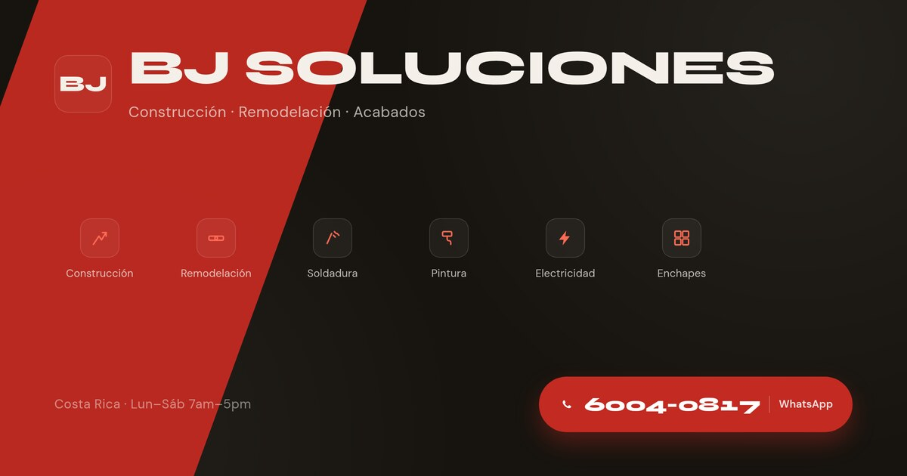

# Identidad — BJ Soluciones

Logo y vista previa de link ya aplicados al sitio (`index.html`, `public/config.json`).
Las 3 propuestas de tarjeta de presentación y los 2 anuncios que se habían generado antes
no se usaron — se descartaron.

## Logo

`public/logo.png` — isotipo cuadrado usado en el header (`config.json` → `"logo"`) y como
base de `public/favicon.png` / `public/apple-touch-icon.png`.

## Vista previa al compartir (og:image)

`public/og-image.jpg` (1200×630), referenciada en `index.html` vía `og:image` / `twitter:image`.
Es la imagen que WhatsApp/Facebook muestran cuando alguien comparte el link del sitio.

## Cómo forzar que Facebook/WhatsApp muestren la versión nueva

Facebook y WhatsApp cachean la vista previa de un link la primera vez que alguien lo comparte,
así que aunque el `og:image` cambie en el sitio, quien ya lo compartió puede seguir viendo la
versión vieja. Para forzar la actualización:

1. Asegurate de que el sitio ya esté desplegado en Netlify con los cambios (hacer `push` y
   esperar el deploy — sin esto, el paso 2 va a volver a cachear la versión vieja).
2. Entrá a **Facebook Sharing Debugger**: https://developers.facebook.com/tools/debug/
3. Pegá la URL del sitio (`https://bj-soluciones.netlify.app` o el dominio final), dale
   **"Debug"** y luego **"Scrape Again"** (a veces hay que darle dos veces). Eso obliga a
   Facebook a volver a leer el `og:image`/`og:title` actuales.
4. Ese mismo scrape normalmente también actualiza la vista previa en **Instagram** y en la
   mayoría de los chats de **WhatsApp**, porque comparten el mismo crawler de Meta. Si un chat
   puntual de WhatsApp sigue mostrando la versión vieja, no hay una herramienta pública para
   forzarlo ahí — se resuelve solo en 24–48h, o compartiendo el link agregando algo al final
   (ej. `?v=2`) para que WhatsApp lo trate como una URL nueva sin caché.
