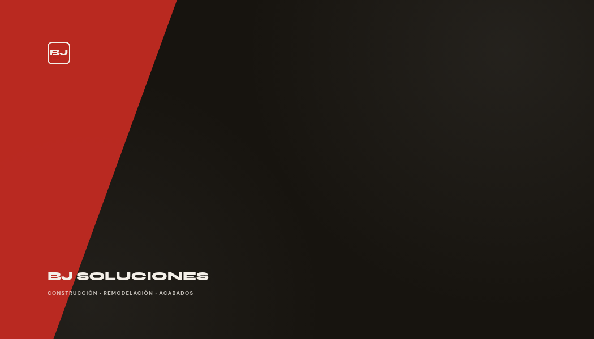
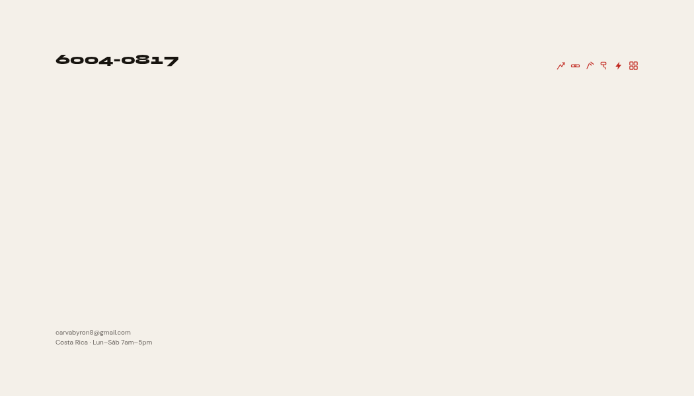
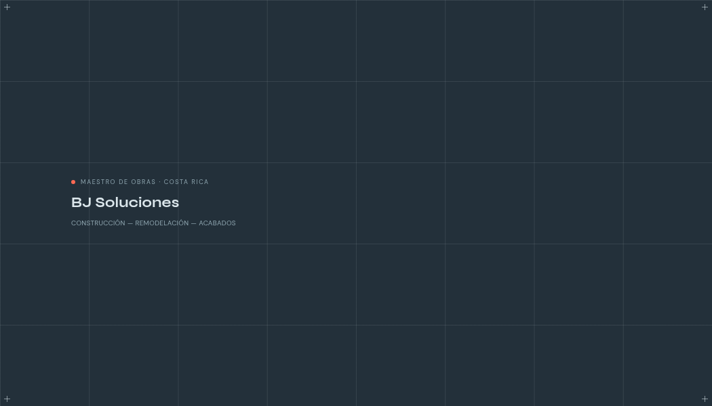
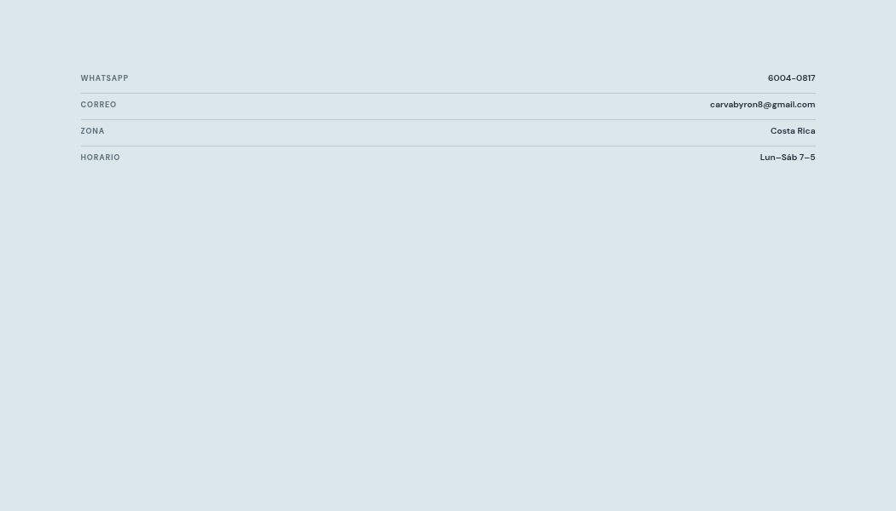
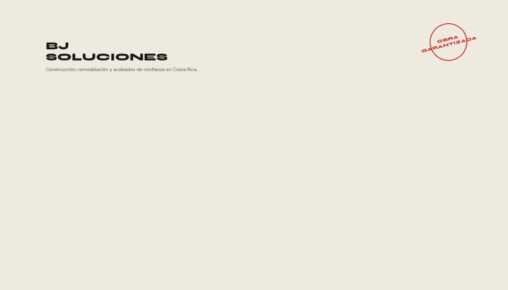
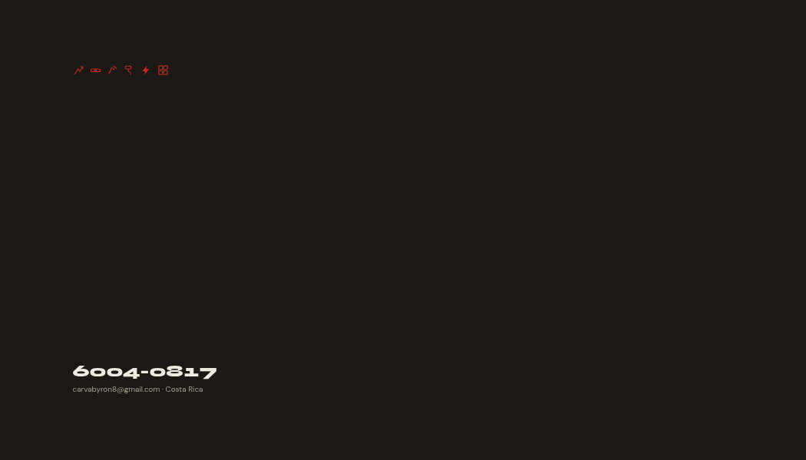
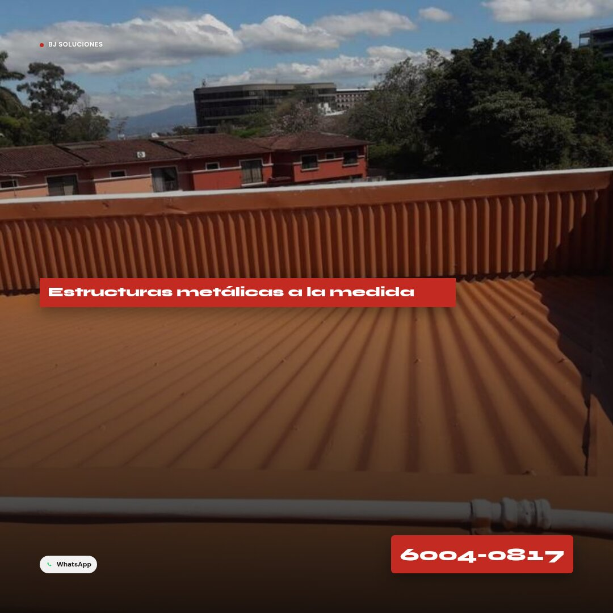
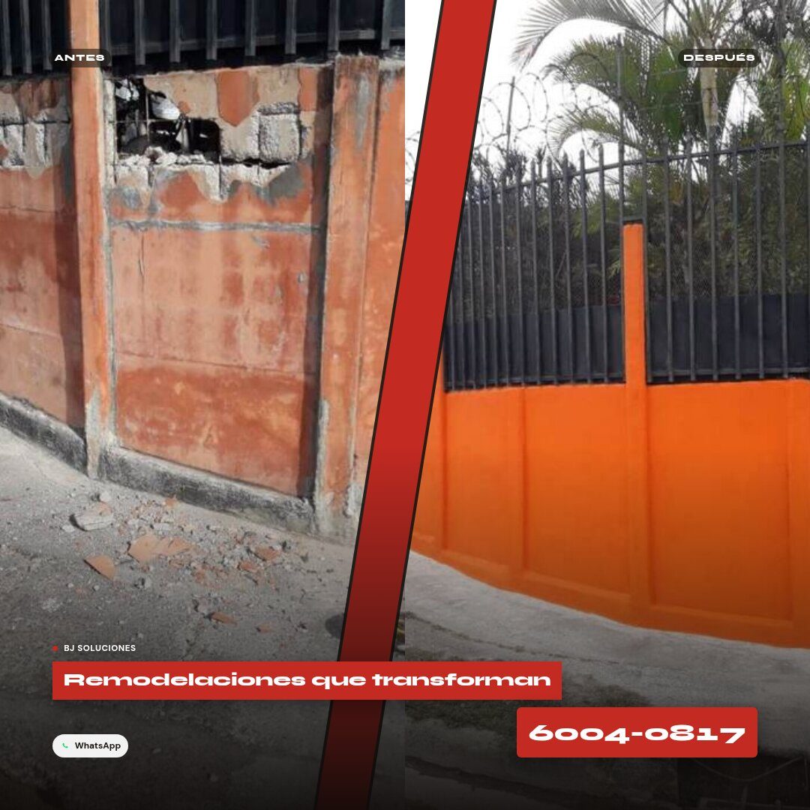

# Propuestas de identidad — BJ Soluciones

Este documento reúne las propuestas de **tarjeta de presentación** y **piezas publicitarias**
generadas para BJ Soluciones, derivadas de la paleta y tipografía que ya usa el sitio
(`public/config.json`: negro `#1A1A1A`, rojo `#D72B2B`, fondo `#F2F0ED`, tipografías Syne + DM Sans).

Los archivos de imagen están en [`docs/branding/`](./branding).

## Ya aplicado al sitio

Mientras se elige la tarjeta final, se implementó el isotipo del concepto **A · Escuadra** como
logo real (era lo más urgente: el link no mostraba imagen al compartirse por WhatsApp/Facebook):

- `public/logo.png` — isotipo cuadrado, usado en el header (`config.json` → `"logo"`) y como base del favicon.
- `public/favicon.png` / `public/apple-touch-icon.png` — reemplazan el favicon de placeholder de Vite.
- `public/og-image.jpg` — imagen de portada (1200×630) con el logo, el nombre, la franja roja del héroe
  y una fila de íconos de los servicios ofrecidos (construcción, remodelación, soldadura, pintura,
  electricidad, enchapes).
- `index.html` — `og:title`, `og:description`, `og:image`, `twitter:card` y favicon reales, en vez del
  `<title>Vitrina Digital</title>` / `Catálogo de productos` genéricos del template.

La tarjeta de presentación (abajo) todavía es una elección abierta entre A/B/C.

## Tarjeta de presentación

### A · Escuadra

Repite el motivo del héroe del sitio actual: negro cálido, franja diagonal roja y un isotipo
"BJ" con una escuadra de carpintero escondida en la esquina. Es la opción más fiel a lo que
ya existe hoy en `App.jsx`.

| Frente | Reverso |
|---|---|
|  |  |

- Paleta: `#17140F` (fondo), `#C22A22` (acento), `#F4F0E9` (reverso/texto)
- Tipografía: Syne 800 (wordmark), DM Sans (contacto y tag)

### B · Plano

Tono azul grafito de plano técnico, retícula fina y marcas de registro en las esquinas; el
reverso se lee como el cajetín de un plano arquitectónico (fila por dato: WhatsApp, correo,
zona, horario). Se siente más "ingeniería", menos publicitaria.

| Frente | Reverso |
|---|---|
|  |  |

- Paleta: `#23303A` (fondo), `#FF6A54` (acento), `#DCE7EC` (reverso/texto)
- Tipografía: Syne 700 (wordmark, tracking amplio), DM Sans (cajetín)

### C · Obra

Fondo claro tipo bodega de materiales, wordmark grande en mayúsculas estilo stencil y un
sello rojo estampado como los que llevan las herramientas y el equipo de obra. Es la más
cruda y directa de las tres.

| Frente | Reverso |
|---|---|
|  |  |

- Paleta: `#EFEAE0` (frente), `#C22A22` (sello), `#1B1815` (reverso)
- Tipografía: Syne 800 uppercase (wordmark), DM Sans (contacto)

## Piezas promocionales (1080×1080, Facebook / Instagram)

### 1 · Oferta directa

Mismo lenguaje del anuncio de referencia (foto de obra + bloque rojo + número de teléfono
enorme), aplicado a un servicio real del catálogo: soldadura y estructuras metálicas.

### 2 · Antes / Después

Formato de comparación con fotos reales de un proyecto ya en `public/catalogo.json`
(remodelación general), dividido por la misma franja diagonal roja del héroe del sitio.

## Qué sigue

1. **Confirmar o cambiar la dirección de marca** — el logo/OG ya aplicados usan el concepto A;
   si en vez se prefiere B o C, se regeneran `logo.png`/`favicon.png`/`og-image.jpg` con esa paleta.
2. **Tarjeta final** — versión imprimible a tamaño real (3.5"×2", frente y reverso) guardada en
   este mismo `docs/`.
3. **Anuncios exportables** — el formato de anuncio elegido, listo en 1080×1080 para publicar,
   y continuar agregando más proyectos y fotos al catálogo.
